# 🚀 Data Redundancy Removal System

A serverless AWS project that detects duplicate employee records, stores only unique data, creates backups, sends notifications, and maintains logs.

---

# 📖 Project Overview

This project validates incoming employee records before storing them in the database.

If a duplicate record exists:

- ❌ The record is rejected.
- 📧 An email notification is sent using Amazon SNS.

If the record is unique:

- ✅ Stored in Amazon DynamoDB
- 📁 JSON backup stored in Amazon S3
- 📧 Success email sent using Amazon SNS
- 📊 Logs stored in Amazon CloudWatch

---

# 🛠 AWS Services Used

| Service | Purpose |
|---------|----------|
| AWS Lambda | Business Logic |
| Amazon DynamoDB | Store Employee Records |
| Amazon S3 | JSON Backup |
| Amazon SNS | Email Notifications |
| Amazon API Gateway | REST API |
| AWS IAM | Permissions |
| Amazon CloudWatch | Logs |
| Postman | API Testing |

---

# 🔄 Project Workflow

```text
User
   │
   ▼
Postman
   │
   ▼
API Gateway
   │
   ▼
AWS Lambda
   │
Validate Employee Data
   │
Check Duplicate
   │
┌───────────────┴───────────────┐
│                               │
Duplicate                    Unique
│                               │
▼                               ▼
SNS Email                 Save to DynamoDB
                                │
                                ▼
                         Backup to Amazon S3
                                │
                                ▼
                         SNS Success Email
                                │
                                ▼
                         CloudWatch Logs
```

---

# 📷 Project Screenshots

## 1. DynamoDB Table

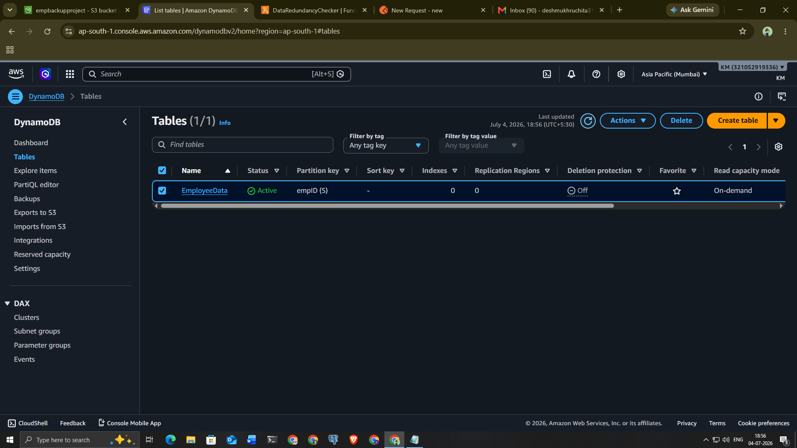


---

## 2. Amazon S3 Bucket


---

## 3. Amazon SNS

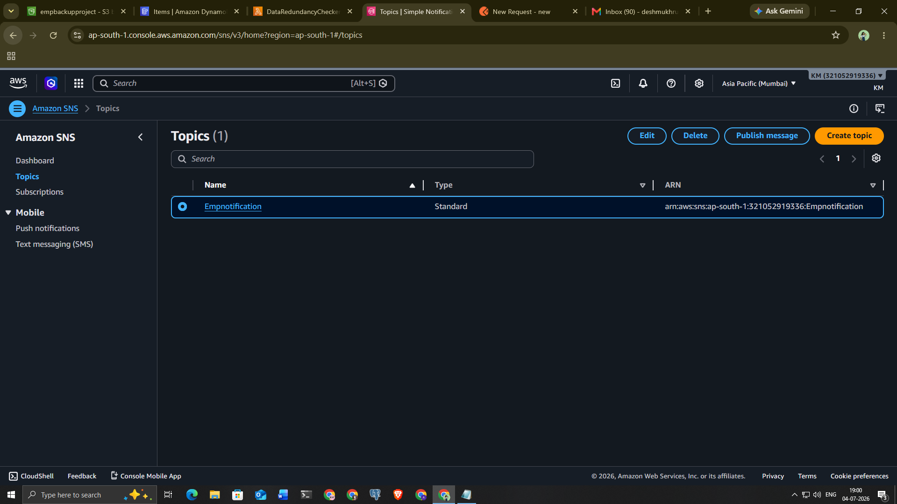

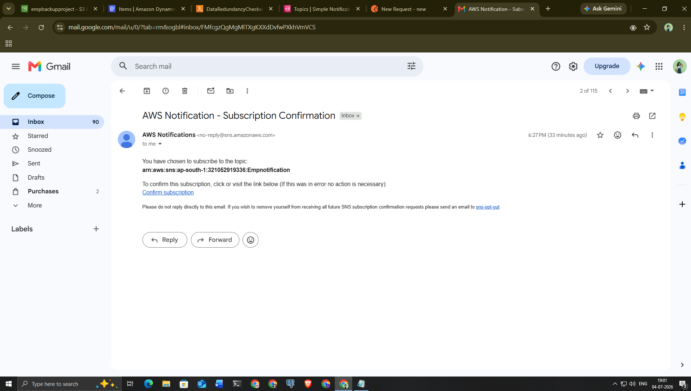


---

## 4. AWS Lambda

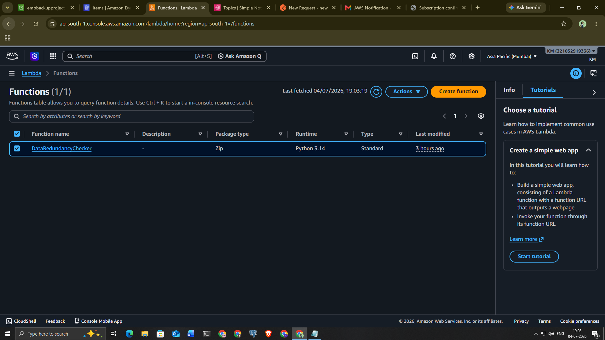

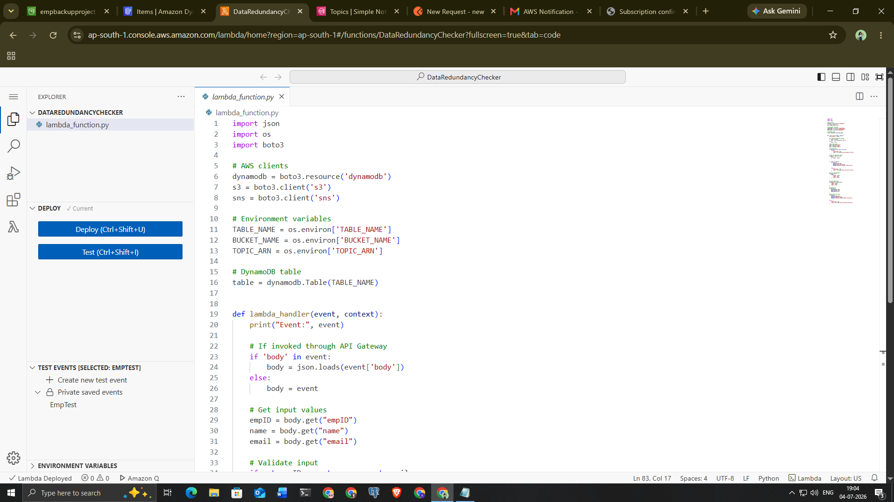


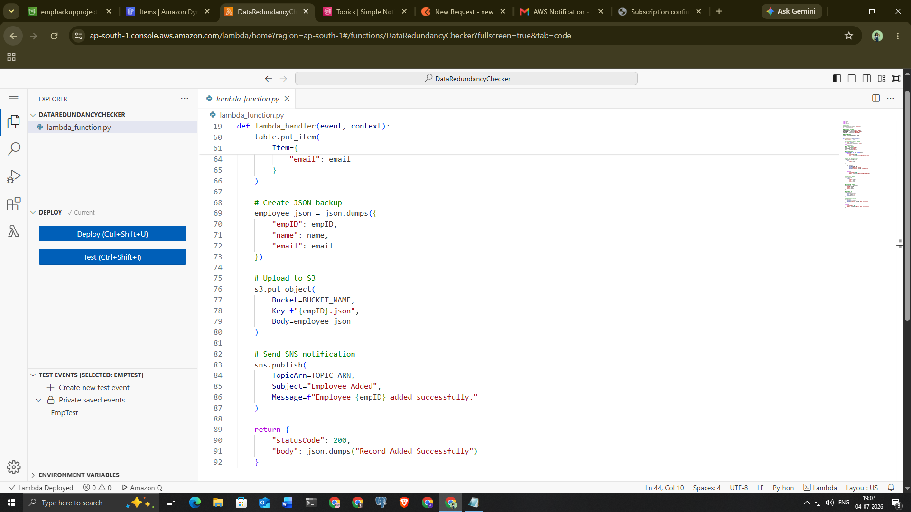

---

## 5. API Gateway

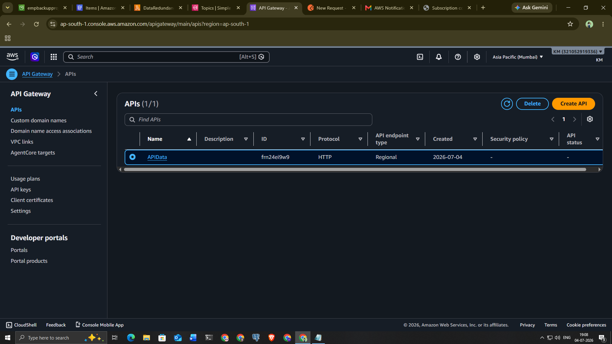

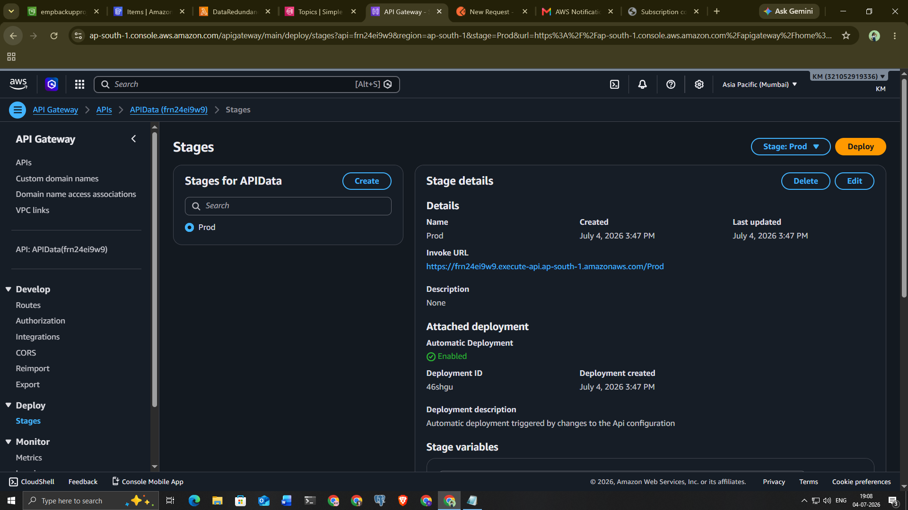

---

## 6. Postman Testing

### Successful Record

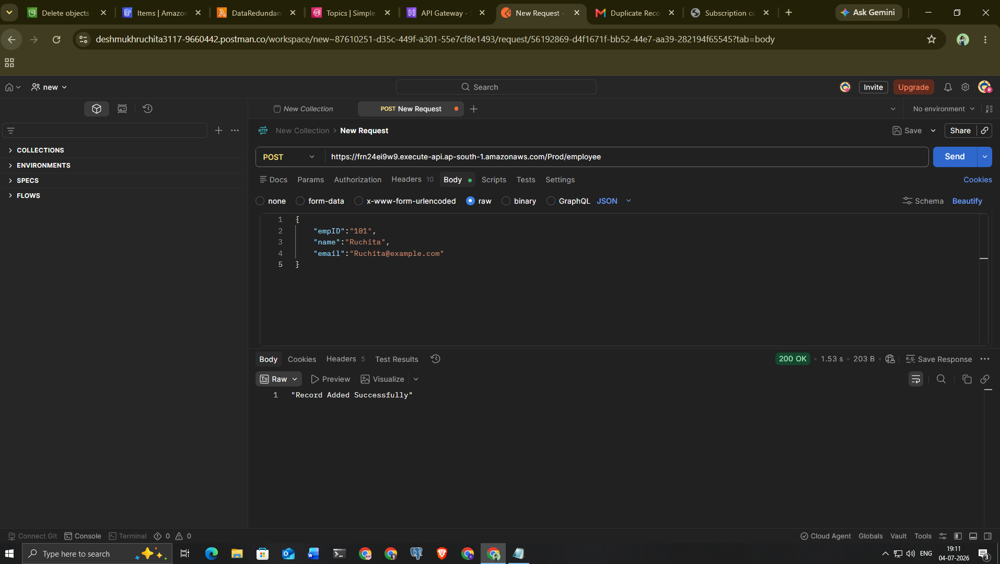

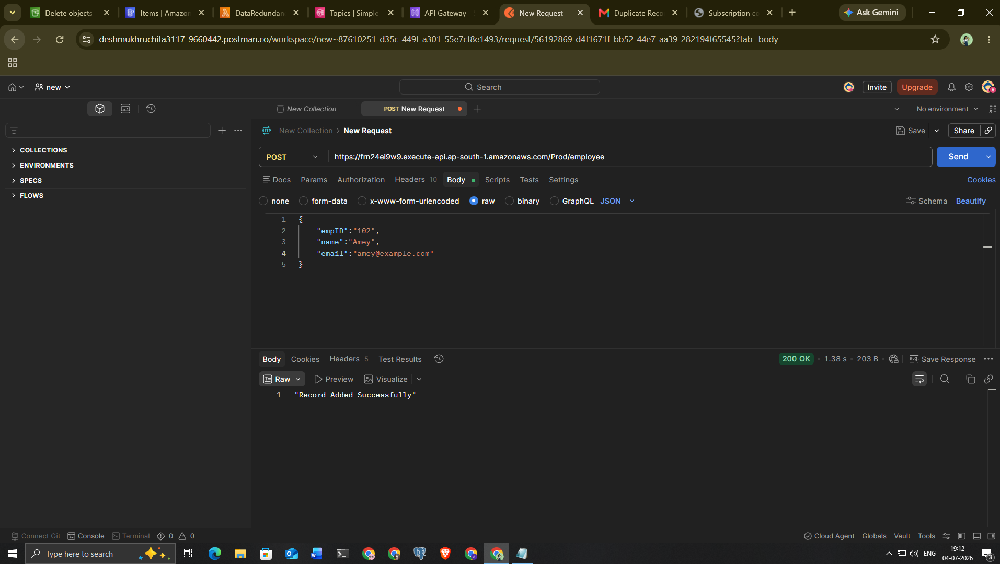

### Duplicate Record

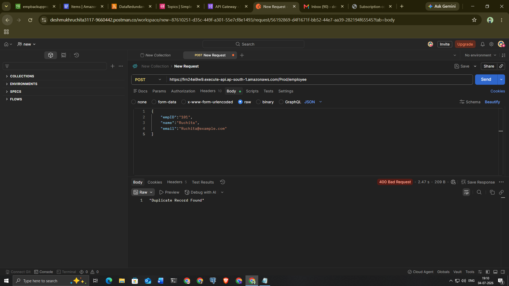

---

## 7. CloudWatch Logs


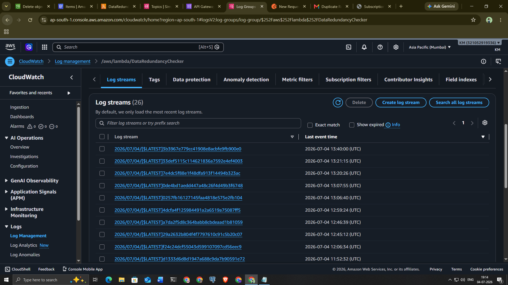

---

## 8. Email Notification


---

## 9. JSON Backup in Amazon S3

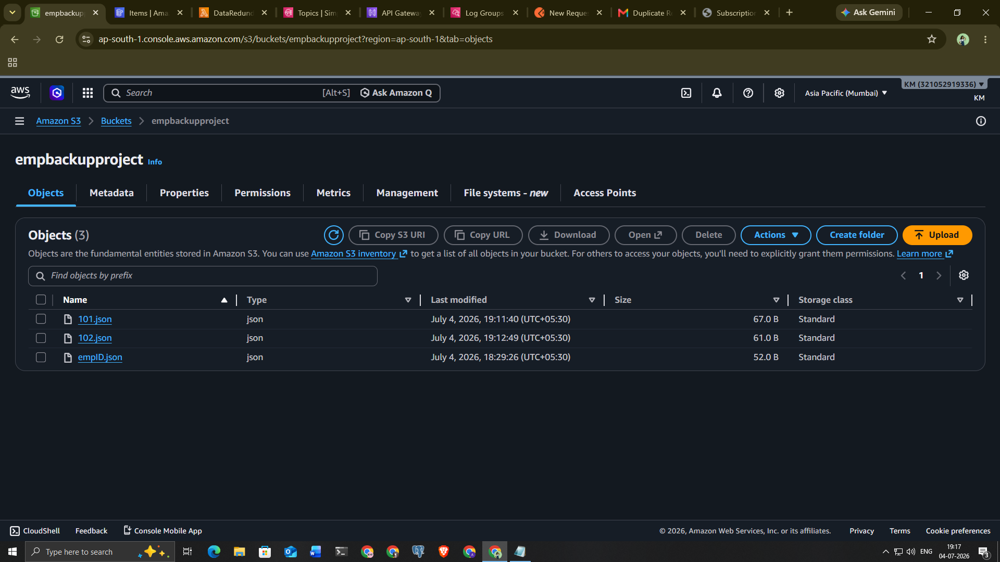

---

# 📤 Sample Request

```json
{
    "employeeId":"101",
    "name":"Ruchita",
    "email":"ruchita@example.com"
}
```

---

# ✅ Success Response

```json
{
    "statusCode":200,
    "body":"Record Added Successfully"
}
```

---

# ❌ Duplicate Response

```json
{
    "statusCode":400,
    "body":"Duplicate Record Found"
}
```

---

# 💻 Technologies Used

- Python
- AWS Lambda
- Amazon DynamoDB
- Amazon S3
- Amazon SNS
- Amazon API Gateway
- AWS IAM
- Amazon CloudWatch
- Postman
- Git
- GitHub

---

# 📂 Project Structure

```
Data-Redundancy-Removal-System
│
├── lambda_function.py
├── requirements.txt
├── README.md
└── Screenshots
```

---

# 👩‍💻 Author

**Ruchita Amey Deshmukh**

AWS Cloud Internship Project

CodeAlpha

---

⭐ If you found this project useful, please give it a Star!
